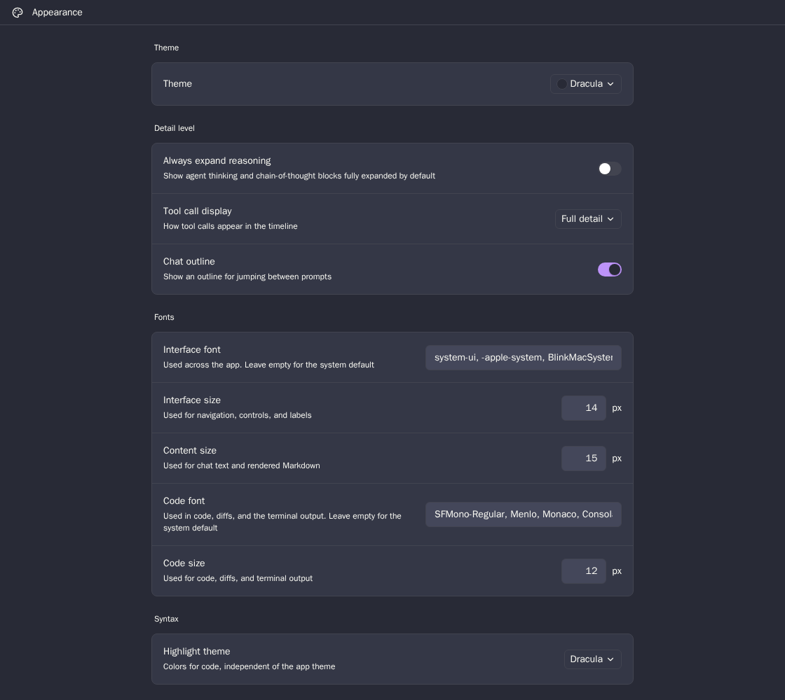

# Dracula for [Paseo](https://paseo.sh)

> A Dracula Classic app theme for Paseo.



## Install

See [INSTALL.md](./INSTALL.md) for Git installation, activation, updates, removal, and local
development installation.

## Theme

This is a minimal, data-only [Dracula Classic](https://draculatheme.com/spec) theme plugin. It
registers one dark theme and no surfaces, commands, RPCs, filesystem access, process access, or
network behavior.

Paseo expands the contributed seed colors into app surfaces, panels, menus, diffs, status colors,
terminal colors, focus treatment, and shadows. Syntax highlighting is a separate Paseo preference;
select **Dracula** under **Settings → Appearance → Highlight theme** for matching code colors.

## Requirements and limits

- Requires Paseo 0.7.2 or later.
- Paseo 0.7 accepts eight contributed-theme seeds. Derived terminal, status, diff, and other UI
  colors remain owned by Paseo.
- The plugin contains no daemon-side behavior and does not read or change application state.

## Palette mapping

Every Paseo contributed-theme seed is set explicitly from the official Dracula Classic palette and
UI palette.

| Paseo seed | Dracula token | Value |
| --- | --- | --- |
| `background` | Background | `#282A36` |
| `foreground` | Foreground | `#F8F8F2` |
| `raised` | Floating interactive elements / Background Light | `#343746` |
| `control` | Selection | `#44475A` |
| `border` | Background Lighter | `#424450` |
| `accent` | Purple | `#BD93F9` |
| `mutedForeground` | Foreground | `#F8F8F2` |
| `ring` | Current Line / Comment | `#6272A4` |

Paseo uses `mutedForeground` for normal-sized metadata and interactive control labels, including
task progress and model selection. Dracula's
[official editor manifest](https://github.com/dracula/visual-studio-code/blob/main/src/dracula.yml)
likewise uses Foreground for buttons, badges, and dropdown text, while reserving Comment for
placeholders and inactive items. Comment would provide only a 2.51:1 contrast ratio on Background
Light; Foreground provides 11.06:1 and satisfies the official specification's 4.5:1 minimum.

## Develop

```bash
bun install
bun run check
bun run typecheck
bun run test
bun run test:coverage
bun run package:release
paseo plugin install /absolute/path/to/paseo-dracula
```

Release Please maintains versions, changelog entries, tags, and GitHub releases from Conventional
Commits. Each release archive contains the complete installable plugin source.

## Team

This theme is maintained by the following person and a group of
[contributors](https://github.com/omercnet/paseo-dracula/graphs/contributors).

| [](https://github.com/omercnet) |
| --- |
| [Omer Cohen](https://github.com/omercnet) |

## Community

- [Dracula Theme](https://draculatheme.com) - Official themes and documentation.
- [GitHub Discussions](https://github.com/dracula/dracula-theme/discussions) - Questions and theme
  discussions.
- [Discord](https://draculatheme.com/discord-invite) - Dracula community chat.
- [Paseo Discord](https://discord.gg/zQAGHFpD8T) - Paseo community support.

## License

[MIT License](./LICENSE). Palette values and token names come from the
[official Dracula Theme specification](https://draculatheme.com/spec).
